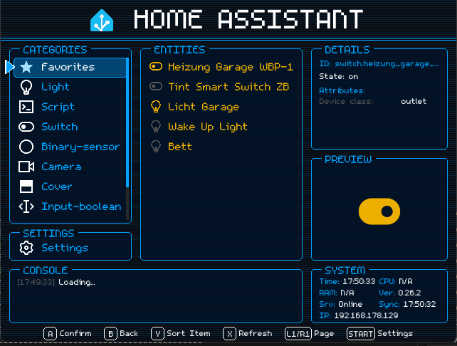
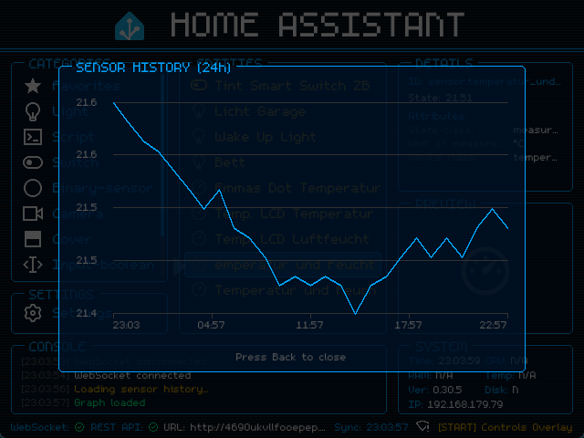
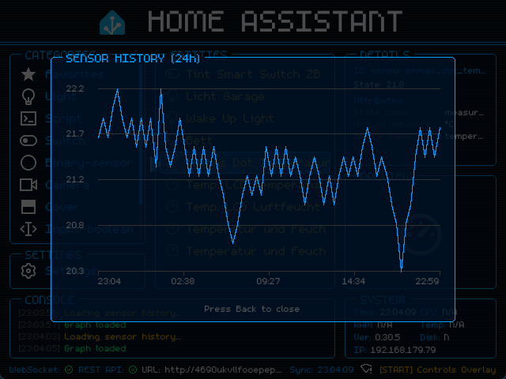
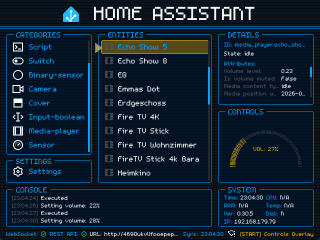
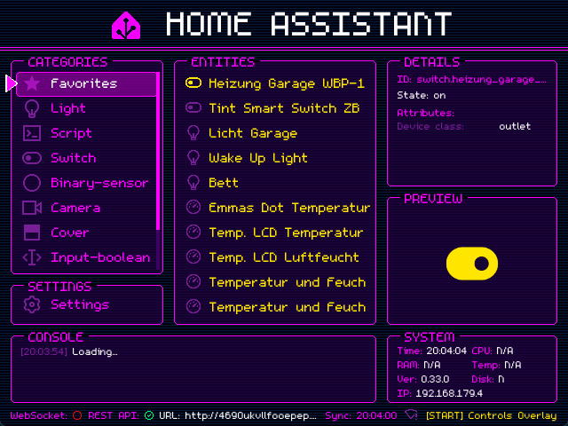
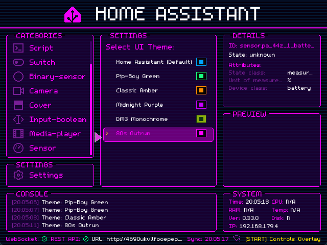
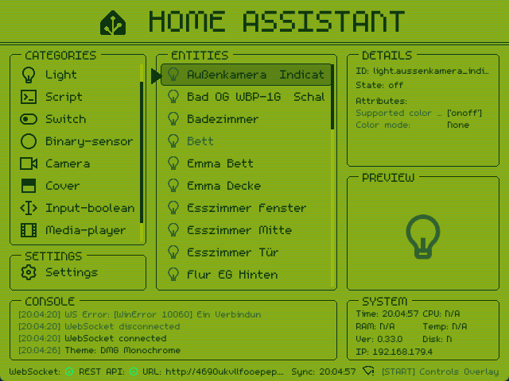
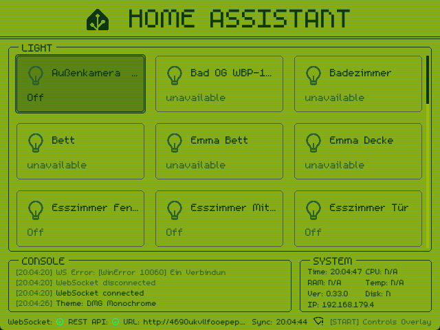

# Home Assistant - for retroconsoles

  

This project is an independent community application and is not affiliated with or endorsed by Home Assistant or the Open Home Foundation.

**A lightweight, controller-driven Home Assistant client for Linux-based retro handhelds. Optimized for PortMaster devices (R36S, TrimUI Smart Pro) with a native SDL2 retro UI.**

Turn your retro handheld into a smart home command center. HA RetroConsole provides a fast, tactile, and native interface to control your Home Assistant environment without needing a browser or mobile app. It focuses on immediate control of favorites, sensors, switches, lights, scenes, and scripts via the Home Assistant REST API.

  
  

  
  

  
  

  
  

## Core Features

- **Native SDL2 UI:** Lean, controller-optimized interface with stable 30 FPS for maximum battery life.
- **Real-time Monitoring:** Live status for sensors, WiFi signal strength (0-4 bars), and system statistics.
- **Visual Retro Charm:** CRT scanline effects, automatic marquee scrolling for long names, and color-coded icons.
- **Handheld Integration:** Seamless D-Pad navigation, display brightness control, and full-screen camera snapshots.
- **PortMaster compatible:** Verified on muOS, Spruce, and Knulli (for R36S, TrimUI Smart Pro, and others).

## Current Status

The application is in a stable, highly functional state and is verified to run smoothly on distributions like muOS, Spruce, and Knulli.

**Latest Highlights (v0.34.1):**
- **Unified Settings Engine:** Merged the two separate settings renderers (list/grid) into a single adaptive layout engine, eliminating duplication bugs.
- **Dynamic Font Loading:** Fonts are now automatically discovered from `assets/fonts/` — no more hardcoded font lists.
- **Settings Submenus:** Reorganized settings into logical categories (Connection, Display, System & Prefs) with nested submenus.
- **Dynamic Theme Engine:** Real-time selectable retro color palettes (including Pip-Boy, DMG Monochrome, and 80s Synthwave) via `themes.json`.
- **PortMaster Ready:** Fully packaged and verified for easy deployment on devices like the TrimUI Smart Pro and R36S.

For detailed setup instructions, see the Installation & Configuration Guide.

## Connectivity & Fallback Note

**Important:** Many handheld Linux distributions (like those used on the R36S or TrimUI Smart Pro) do not support mDNS out of the box. 

It is highly recommended to use the **IP address** of your Home Assistant server (e.g., `http://192.168.1.100:8123`) in your `config.json` instead of `http://homeassistant.local:8123`.

### Fallback Server URL
If you want to use the application both at home and on the go (e.g., via VPN, WireGuard, or external access), you can configure a fallback server URL:
- Specify your local IP address under `base_url` for fast local home network connectivity.
- Specify your external domain or Nabu Casa URL under `alternative_url` in your `config.json`.

On startup, the client automatically tests connectivity to the primary `base_url` first, and seamlessly falls back to the `alternative_url` if the primary is unreachable.

## Quickstart

1. Copy `config.example.json` to `config.json`.
2. Enter your Home Assistant URL and a Long-Lived Access Token.
   - Create the token in Home Assistant under your user profile: `Profile -> Security -> Long-lived access tokens`.
3. Transfer the `ha-retroconsole` folder and the `.sh` launcher to your device's `/roms/ports/` directory as described in the Installation Guide.

## Roadmap
The development is structured in several phases. We have reached a stable release candidate.
* **Phase 0-5:** Core development, connectivity, and device stability (Completed).
* **Phase 6:** Refinement & Advanced Features (v0.29.2) (Completed).
* **Phase 7:** Advanced Control Components (v0.30.0) (Completed).
* **Phase 8:** Extended Integrations & UI (v0.32.0) (Completed).
* **Phase 9:** Dynamic Themes & Fonts (v0.33.0) (Completed).
* **Phase 10:** Future Plans (Area Support, MJPEG, i18n).
Detailed progress and future plans can be tracked in docs/ROADMAP.md and docs/CHANGELOG.md.

## Special Thanks

A big thank you to [Remix Icon](https://remixicon.com/) for providing the excellent open-source icons under the Apache License 2.0.
- This project bundles several open-source libraries, including [Requests](https://requests.readthedocs.io/) (Apache 2.0), [PySDL2](https://pysdl2.readthedocs.io/), and [websocket-client](https://github.com/websocket-client/websocket-client).

## Security

`config.json` contains your private Home Assistant token and should not be committed.
